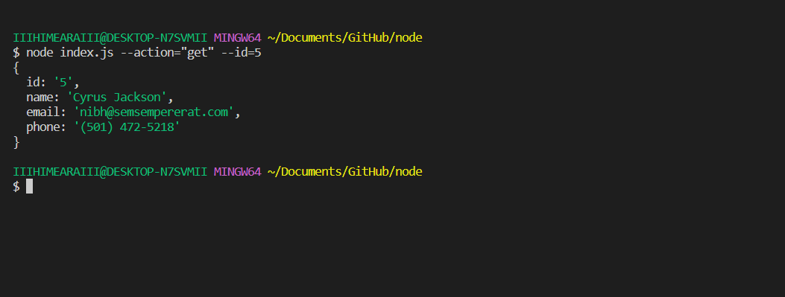
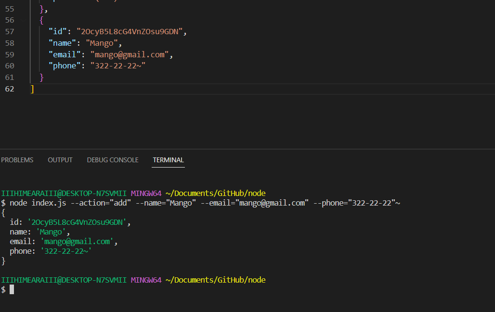

1. node index.js --action="list"

2. node index.js --action="get" --id=5

3. node index.js --action="add" --name="Mango" --email="mango@gmail.com" --phone="322-22-22"

4. node index.js --action="remove" --id=3

